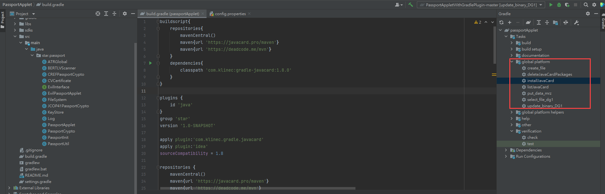
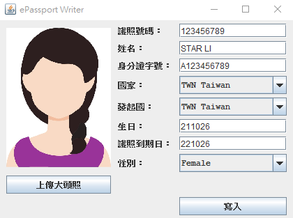
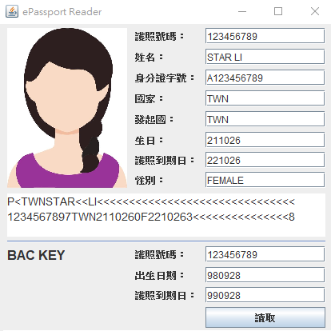
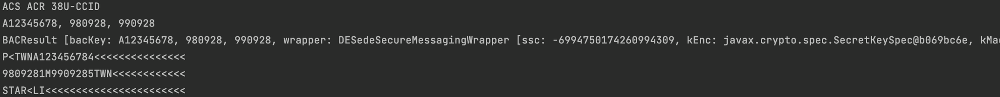
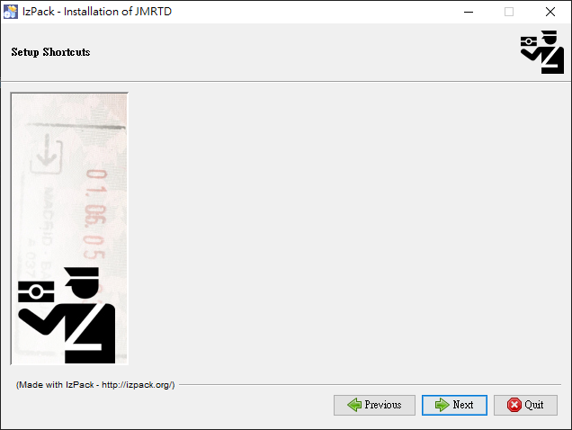
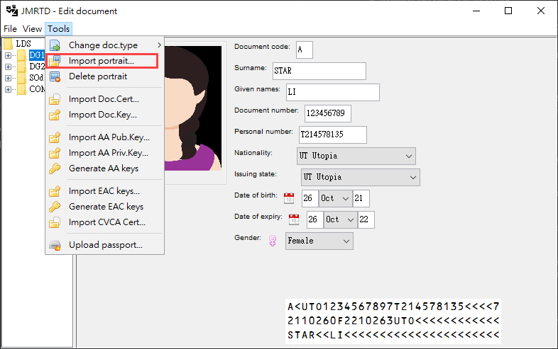
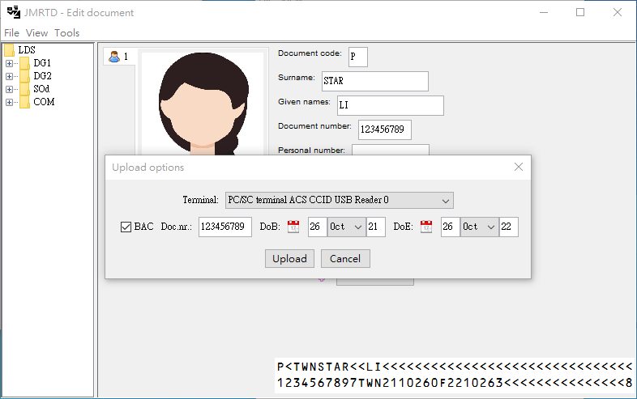
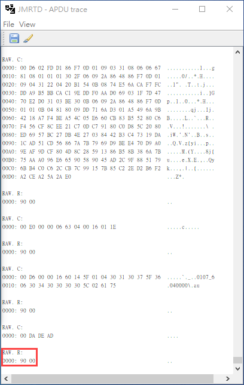
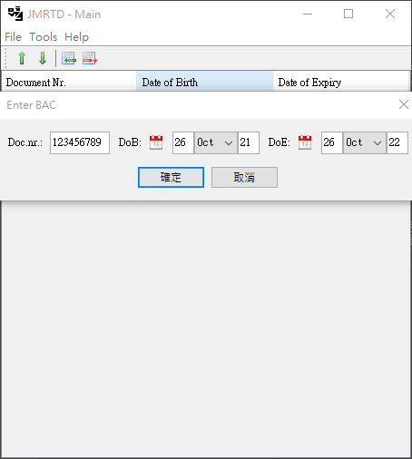
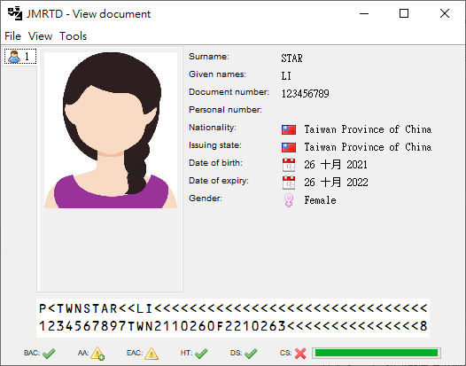

# ePassport
- 此專案皆以 `IntelliJ` 開發
## ePassportApplet (安裝Applet工具)
利用 Gradle Script 安裝 ePassport Applet，點擊右方 `installJavaCard`:

## ePassportWriter App (寫卡)
### 寫入白卡
- 直接執行 WriterCard.java ，輸入資料後上傳大頭照，最後點擊寫入按鈕，成功寫入 ePassport: 
  - 
## ePassportReader App (讀卡)
### 讀取白卡
- 直接執行 Reader.java ，輸入BAC key後，點擊讀取按鈕，成功讀取 ePassport:
  - 
### 讀取真實護照
- 直接執行 Reader.java ，輸入BAC key後，點擊讀取按鈕，成功讀取 ePassport: 
  - 
## JMRTD App
### 步驟
0. 必須先使用 ePassportApplet 執行 installJavaCard ，才可使用 ePassport Tool 寫護照
1. 安裝 `jmrtd_installer-0.4.9.exe`，安裝過程會有當機現象，直接退出即可

2. 預設安裝路徑為 `C:\Program Files\JMRTD`，打開 `jmrtd.bat`
3. File -> New，建立新護照，並選擇 Tool -> Import Portrait，注意必須上傳 `JPG` 格式的大頭照，否則上傳過程會出現 `6F00` 錯誤並 fail

4. Tools -> Upload passport，輸入 BAC Key，點擊 Upload 開始將護照寫入卡片

    - 寫入成功 APDU trace 底端會是 `9000`
      - 
5. 回到 JMRTD 主介面，選擇 Tools -> Reload Cards，輸入剛才的 BAC Key
    - 
6. 讀取護照成功
    - 
7. 上傳護照後，put_mrz 的功能會被鎖上，所以若想上傳不同護照，需要先刪掉 applet 再利用 ePassportApplet 重新安裝 applet，最後在從第三步開始重做，否則會出現 `6985` error
    - 刪除 passport applet (若出現無法刪除的情況，可加上 `-f` 嘗試):
        ```
        gp -delete A00000024710
        ```
    