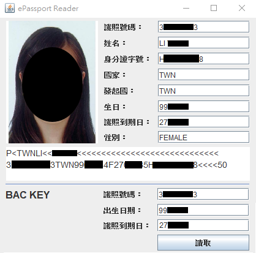

# ePassport
- 此專案中 ePassportApplet、ePassportReader 皆以 `IntelliJ` 開發
## ePassportApplet (寫卡)
利用寫好的 Gradle Script 寫入 ePassport: 

### 步驟
1. installJavaCard
2. createfile

3. put_data_mrz

4. update_binary_DG1

## ePassportReader (讀卡)
直接執行 ePassportReader.java ，利用預設 BAC key 通過 BAC 驗證，成功讀取 ePassport: 

## ePassport Tool 讀/寫卡
### 步驟
1. 安裝 `jmrtd_installer-0.4.9.exe`，安裝過程會有當機現象，直接退出即可

2. 預設安裝路徑為 `C:\Program Files\JMRTD`，打開 `jmrtd.bat`
3. File -> New，建立新護照，並選擇 Tool -> Import Portrait，注意必須上傳 `JPG` 格式的大頭照，否則上傳過程會出現 `6F00` 錯誤並 fail

4. Tools -> Upload passport，輸入 BAC Key，點擊 Upload 開始將護照寫入卡片

    - 寫入成功 APDU trace 底端會是 `9000`
      - 
    - 完成後可利用 ePassportReader 驗證是否成功
      
6. 回到 JMRTD 主介面，選擇 Tools -> Reload Cards，輸入剛才的 BAC Key

7. 讀取護照成功
    - 
8. 上傳護照後，put_mrz 的功能會被鎖上，所以若想上傳不同護照，需要先刪掉 applet 在從第四步開始重做，否則會出現 `6985` error
    - 刪除 passport applet:
        ```
        gp -delete A00000024710
        ```